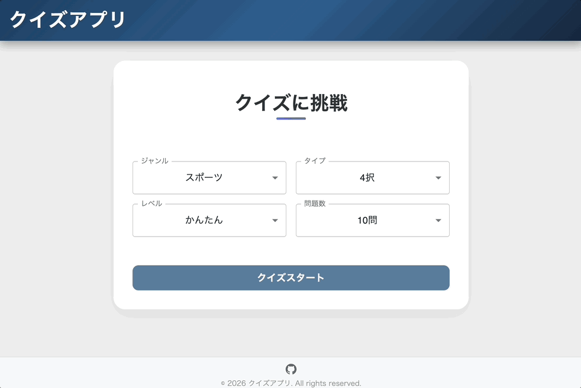

# クイズアプリ（React / Redux Toolkit）

## 概要

Open Trivia Database（OpenTDB）を利用したクイズアプリです。ジャンル・タイプ・難易度・問題数を選択し、柔軟にクイズへ挑戦できます。

**設計の主眼は「責務分離」と「テストしやすさ」**。UI／状態管理／ドメインロジック／API 通信を明確に分離し、変更に強い構成を採用しています。

---

## デモ / リンク

- 

- [🚀 実際のアプリはこちら](https://quiz-app-zeta-pearl.vercel.app/)

---

## 特長

- **レスポンシブ対応**：スマホ・タブレットでも快適な操作性
- **落ち着いた配色**：長時間プレイでも疲れにくいマットデザイン
- **拡張しやすい設計**：新しい条件・表示の追加が容易
- **直感的な正誤フィードバック**：回答後、正解（緑）と不正解（赤）をボタン色で即座に提示。メッセージに頼りすぎない直感的な UX を追求
- **堅牢な入力バリデーション**：不正な設定での開始を未然に防ぎ、エラー箇所をユーザーに分かりやすく明示
- **詳細な結果サマリー**：全問題の正誤をリストアップ。自分の回答と正解を対比して確認できるレビュー機能を搭載
- **スムーズなリトライフロー**：同じ条件での再挑戦をワンクリックで実現

---

## 使用技術

- React
- Redux Toolkit
- React Router
- Axios
- lodash / he
- JavaScript（ES Modules）

---

## アーキテクチャ

```
UI（Component）
  ↓
Custom Hook
  ↓
Redux（Slice / Selector）
  ↓
Model
  ↓
Fetcher（API）
```

### 設計方針

- **AppRoutes による関心事の分離**：ルーティングロジックを独立させ、App.jsx の見通しを向上
- UI は描画に専念
- ビジネスロジックは Model / Redux に集約
- API 仕様を UI に漏らさない
- **一元化されたエラーハンドリング**：独自のエラークラス（QuizError）を定義し、ネットワークエラーとドメインエラーを明確に区別して処理

---

## 状態管理（Redux）

### Slice 構成

- **quizContent**：クイズの取得・保持
- **quizProgress**：進行状況・回答結果
- **quizSettings**：開始前の設定情報

### ルール

- Redux state は **事実データのみ** を保持
- 派生データは **selector** に集約
- **Thunk による二重リクエストの防止**：`condition` オプションを活用し、ローディング中の重複した API コールを中断（429エラー対策）

---

## Model / Fetcher

- **Fetcher**：API 通信のみを担当
- **Model**：
  - データ整形（API 特有の特殊文字デコード処理など）
  - 正誤判定
  - 配列のシャッフル（lodash 活用）
  - 表示用データ変換（難易度の日本語翻訳など）

UI 層は API レスポンス構造を直接扱いません。

---

## コンポーネント設計

- **Component**：描画専用
- **Custom Hook**：画面ロジック・副作用を集約
- Redux の `selector / dispatch` は Hook 経由のみ

---

## テスト戦略

**「信頼性と開発速度の両立」**を掲げ、カスタムユーティリティを活用した高効率なテストを実施しています。

### テスト基盤

- **Custom Renderers**：Redux Toolkit と React Router をラップした `renderWithStore` / `renderHookWithStore` を構築。本番環境に近い状態でコンポーネントや Hook を検証可能。
- **分離されたテスト責務**：
  - **Hook テスト**：ビジネスロジック、状態遷移、副作用（Dispatch/Navigate）を網羅。
  - **Component テスト**：UI の表示状態（Disabled/Error 等）と、ユーザー操作の疎通を検証。

### テスト対象と範囲

| レイヤー      | テスト内容                                                     | ツール                |
| :------------ | :------------------------------------------------------------- | :-------------------- |
| **Model**     | データ整形・デコード・シャッフル等の純粋関数                   | Vitest                |
| **Redux**     | Slice の初期状態、Action による状態遷移、Selector の派生データ | Vitest                |
| **Hooks**     | dispatch 連携、条件付きロジック（useHomePage 等）              | React Testing Library |
| **Component** | ルーティング、エラー表示、インタラクションの疎通               | React Testing Library |

---

## 画面構成 / フロー

- **Home**：条件選択
- **Quiz**：出題・回答・結果表示

```
graph LR
  Home[Home: 条件選択] -->|Validation| Quiz[Quiz: 出題・回答]
  Quiz -->|API Fetch| Quiz
  Quiz --> Result[Result: 結果表示]
  Result --> Home
```

---

## 学び・工夫

- Model / Redux / UI の責務分離
- Selector による派生データ管理
- テスト範囲の取捨選択
- Redux Toolkit を用いた状態設計の整理
- 課題解決策効果

状態の不整合 (ホーム遷移時に古いクイズデータが残る),Reduxの extraReducers を活用し、resetQuizContent アクションに連動して全スライスを初期化する連鎖リセットを実装。,常にクリーンな状態でアプリを開始でき、予期せぬバグを防止。
レンダリングの競合 (APIエラー時に未定義データを読み込みクラッシュ),Pageレベルで「Loading/Error」「Result」「Content」の排他的なレンダリングガードを実装。,不正なデータでのコンポーネント実行を根本から遮断し、堅牢性を向上。
ロジックの重複 (複数箇所でのリセット・遷移処理),カスタムフック useNavigationHelpers を作成し、ナビゲーションロジックを共通化。,DRY原則に基づき、メンテナンス性と可読性を大幅に改善。

💡 設計におけるこだわり
堅牢なUIライフサイクル: API取得の「開始・成功・失敗」に合わせ、UIの状態（スピナー、エラーメッセージ、クイズ画面）が正確に切り替わるよう設計。
直感的なエラー復旧: QuizLoading 内に再読み込みボタンを配置し、ネットワークエラー等のトラブルからユーザーが迷わず復旧できる導線を確保。
Atomicな状態管理: 各スライスの役割を「事実データ」に限定し、スライス間連携をアクションの監視（extraReducers）で行うことで、疎結合なアーキテクチャを実現。

---

## 今後の改善案（Optional）

- 問題履歴・スコア保存
- カテゴリ別ランキング
- テストカバレッジの可視化

## 技術的な挑戦と解決策

| 課題                                         | 解決策                                                                       |
| :------------------------------------------- | :--------------------------------------------------------------------------- |
| コンポーネントと Redux の結合テストが複雑    | `renderWithStore` を導入し、Provider 設定を隠蔽して宣言的なテストを実現      |
| App.jsx の肥大化とルーティングの不透明性     | `AppRoutes.jsx` を切り出し、ルーティング設定を宣言的に一元管理               |
| UI と Hook のテスト重複による保守性低下      | 責務を「ロジック（Hook）」と「配線・表示（UI）」に整理し、テストの重複を排除 |
| 短時間の連続リクエストによる API エラー(429) | `createAsyncThunk` の `condition` によるリクエストガードを実装               |
| API レスポンス内の特殊文字（&quot; 等）      | `he` ライブラリを Model 層に導入し、UI に届く前にデコード                    |
| 回答後の視認性向上                           | ボタンの状態（正解・不正解・無効）を `colorStatus` プロパティで一括管理      |
